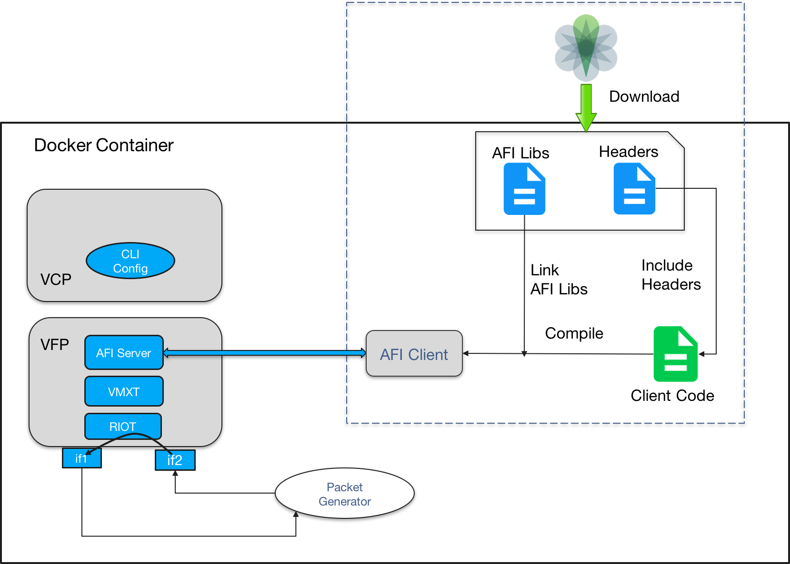
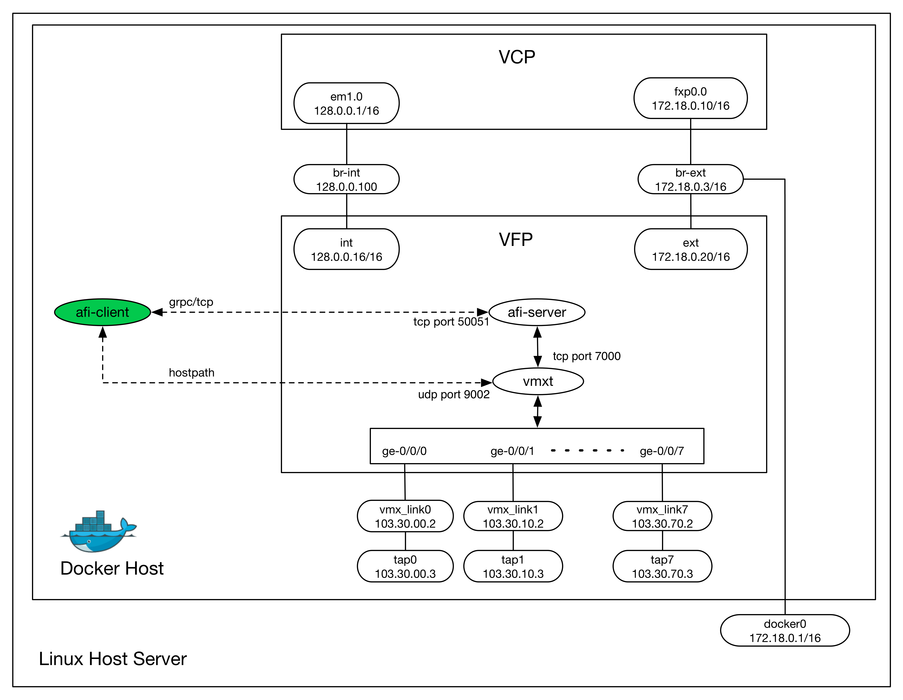
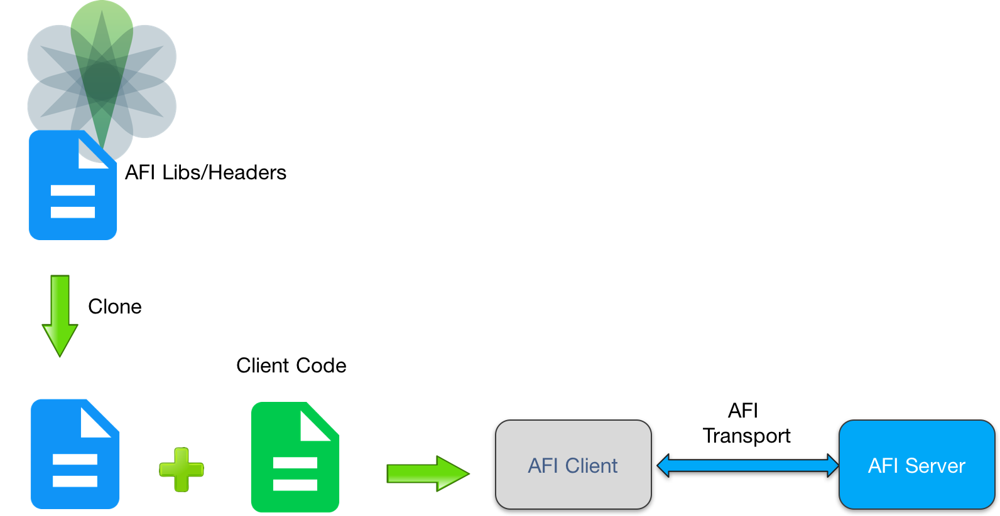

##### Note: Use of this software is governed by an Apache 2.0 license, and can be found in the “LICENSE” file.

AFI (Advanced Forwarding Interface)
===================================
Packet forwarding, at its core, is a sequence of operations executed by a packet forwarding engine (PFE). The packet forwarding engine, when given an input packet, performs this sequence of operations on the packet. Each of these operations can be represented by a node in a graph of potential packet forwarding operations. When a packet is given to packet forwarding engine, it executes the operations in the graph that match the packet. AFI provides third party developers with the ability to control and manage a section of forwarding path graph. 

AFI views a forwarding path as a collection of connected nodes in a hybrid graph. AFI provides clients with the ability to program a section of the forwarding path 
via a small virtual container called a sandbox.  Using AFI APIs, AFI client can create and manage forwarding paths inside a forwarding sandbox. 

Please read '[**AFI Introduction**](./docs/AFI.pdf)' document for a quick overview of AFI. Details of AFI APIs can be found in '[**Doxygen Documentation**](https://juniper.github.io/AFI/doxygen/html/index.html)'. 

<br>
<div style="text-align:center" align="center"></div>
<br>
<br>

AFI GitHub Repository
=====================
This repository provides -
* [AFI Introduction](./docs/AFI.pdf) document
* Example AFI client applications
* Dockerfile/s to build Docker container/s which provides AFI client development and execution environment
* AFI APIs [Doxygen Documentation](https://juniper.github.io/AFI/doxygen/html/index.html)

#### Repository Directory Structure
Please note only important files and directories are listed here:
```
 -- AFI
    |-- LICENSE                     License 
    |-- README.md                   This README file
    |-- tools
    |   `-- docker                  Files/scripts to build/setup docker container/s
    |-- docs
    |   |-- AFI.pdf                 AFI Introduction document
    |   `-- doxygen                 Doxygen documentation
    `-- example-clients             Reference AFI clients
        `-- afi-client
```

Requirements
=====================
#### Juniper Networks Software
Packages available on [vMX Eval Download](http://www.juniper.net/support/downloads/?p=vmxeval#sw) page
```
vMX AFI 1.0 Beta : VMX (beta) bundle which supports AFI
AFI 1.0          : AFI APIs libs/headers package
```
Note: A valid user account is required to access and download the files.

#### System Requirements
```
Hardware requirements
=====================
Processor: 
    Any x86 processor (Intel or AMD) with VT-d capability
Number of Cores: 
    4 (1 for VCP and 3 for VFP)
Memory:
    Minimum:
    8 GB (2 GB for VCP, 6 GB for VFP)
    Additional
    2 GB recommended for host OS
Storage: 
    Local or NAS. Minimum 200 GB is recommended.
Other Requirement:
    Intel VT-d capability
       
Software requirements
=====================
Operating system
    Ubuntu 14.04 LTS (recommended host OS)
    Linux 3.13.0-32-generic
```

<br>
<br>
<br>
<br>

AFI Client Development Environment and Workflow
===============================================
 
<br>
<br>
<div style="text-align:center" align="center"></div>
<br>
<br>

<br>

### STEP 1. Install Docker engine on Linux host server
You may want to refer to instructions provided on the following page to install docker engine on the host server  
[https://docs.docker.com/engine/installation/linux/ubuntulinux/](https://docs.docker.com/engine/installation/linux/ubuntulinux/)

Note: Please follow the instructions provided on the above page for Ubuntu Trusty 14.04 (LTS)

<br>

### STEP 2. Set docker options

Add following line in /etc/default/docker file
```
DOCKER_OPTS="--bip=172.18.0.1/16"
```

and restart Docker service (sudo service docker restart)

The option '--bip=$DOCKER0_BRIDGE_IP' makes sure that Docker container uses $DOCKER0_BRIDGE_IP as IP for "docker0" bridge.

NOTE: 
By default, docker uses location '/var/lib/docker' to install images. You can use '-g <location>' option to specify the docker image installation location.  Please make sure that the location has around 200GB of space available.

<br>

### STEP 3. Git clone AFI repository (to get Dockerfile/s to build docker container/s)
```
git clone https://github.com/Juniper/AFI.git
```

<br>

### STEP 4. Build docker container where AFI client can be compiled and run
```
cd AFI/tools/docker
docker build -f Dockerfile_afi -t afi-docker .
```

<br>

### STEP 5. Download 'VMX bundle' and copy it to AFI/tools/docker folder.

Please download "vMX AFI 1.0 Beta (vmx-bundle-17.2I20170329_2254_sksodhi.tgz)" 
from Juniper vMX Eval download page 
[vMX Eval Download](http://www.juniper.net/support/downloads/?p=vmxeval#sw),
and copy it to AFI/tools/docker/ directory.

<br>

### STEP 6. Build docker container where VMX can also be run
This step uses the container built in the previous step and builds another docker 
container where provided VMX can also be run.
```
cd AFI/tools/docker
docker build -f Dockerfile_afi_vmx --build-arg VMX_BUNDLE=<vmx bundle image> -t afi-vmx-docker .
E.g.
docker build -f Dockerfile_afi_vmx --build-arg VMX_BUNDLE=vmx-bundle-17.2I20170329_2254_sksodhi.tgz -t afi-vmx-docker .
```

<br>

### STEP 7. Run Docker container
```
docker run -i -t --privileged afi-vmx-docker
```
<br>

#### Note: Rest of the steps are to be performed inside docker container

<br>

### STEP 8. Start/setup VMX (inside the container)
```
cd /root
./scripts/setup_vmx.sh
```
Please wait for the following message to appear before proceeding with next step. <br>
"VMX Setup Complete!" <br>
Please allow few minutes for VMX setup to complete. <br>
After this step, following setup/environment (less the afi-client) will be ready.
<br>
<div style="text-align:center" align="center">  </div>
<br>
<br>

### STEP 9. Download 'AFI APIs libs/headers package' and decompress it

<br>
<div style="text-align:center" align="center">  </div>
<br>

Please download "AFI 1.0 (afi-1.0.tgz)" from Juniper vMX Eval download page -
[vMX Eval Download](http://www.juniper.net/support/downloads/?p=vmxeval#sw)

```
tar xf afi-1.0.tgz
```
Note: Please ignore any "Ignoring unknown extended header keyword" logs which are displayed while decompressing the tarball.

<br>

### STEP 10. Clone AFI git repository
```
git clone https://github.com/Juniper/AFI.git
```
Note: Please make sure that you clone afi repo at the same level where you decompressed 'AFI APIs libs/headers package' (i.e. afi-1.0.tgz)

<br>

### STEP 11. Check if development environment has been setup properly

```
cd AFI/example-clients/afi-client/test/
make
./run-afi-gtest 
```
If all GTEST test cases pass, you are good to go.

<br>

### STEP 12. Write client application using AFI APIs

Please refer example afi clients provided at [**./example-clients**](./example-clients/). <br>
Compiling/running instructions for each client can be found in the README file provided with the client.

<br>

### STEP 13. Compile client application 

Following directories need be added in the include path.
```
afi-1.0/include/afi-transport/
afi-1.0/include/aft-client/
```
AFI client application links with following libraries
```
afi-1.0/lib/libafi-transport.so
afi-1.0/lib/libaft-client.so
```
